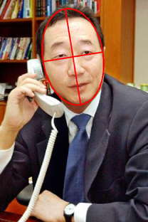
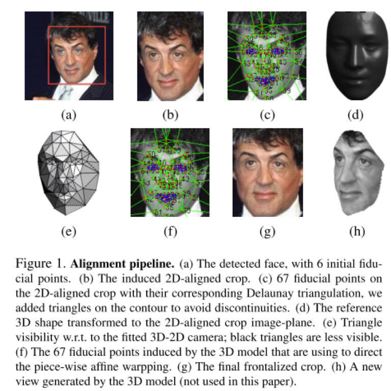

人脸识别初步调研报告
====================

1. 背景
=======

1.1 应用背景
------------

随着社会的不断发展与科技的不断进步，人脸信息处理的研究已经成为当前的研究
热点之一，是生物特征识别、视频监控、人机交互、安防系统、内容检索以及电视会议等领域的研究基础，对上述领域的发展起到非常重要的作用。人脸检测是人脸信息处理中的一个关键环节，是自动人脸识别的前提和基础，人脸检测性能的好坏，直接影响着人脸信息处理的结果。

人脸识别(Face
recognition)是指基于一定的算法或策略对任意的输入图像或图像序列进行一定的搜索遍历，从而判断其中是否包含人脸，如果包含人脸，则定位出每个人脸的位置、大小以及姿态。自从上个世纪60.70年代，人们便开始利用计算机进行人脸检测与识别的研究，经过几十年的不断发展已经逐渐成熟，成为计算机视觉领域中
的研究热点。起初的人脸识别问题的研究往往假设人脸位置已经获得或很容易获得，主要针对的是无背景图像或背景图像非常简单的人脸图像，因此人脸检测问题并未受到充分的重视。然而，在实际应用中，往往人脸图像的背景是非常复杂的，上述的假设很难满足实际应用系统的需求。为了使人脸识别系统能够得到广泛的应用，就必须首先从实际的复杂背景中检测和定位出人脸。因此，人们开始进行了复杂背景下的实时人脸检测研究。从此，人脸检测开始逐渐受到广大研究工作者的重视，并逐渐发展为模式识别与计算机视觉领域一个独立的研
究课题。

与其它的生物特征相比，人脸特征具有自然性、方便性和非接触性等优点，使其在安全监控、身份验证、人机交互等方面具有巨大的应用前景。

1.2 硬件背景
------------

英伟达以其大规模的并行GPU和专用GPU编程框架CUDA主导着当前的深度学习市场。而且越来越多的公司开发出了用于深度学习的加速硬件，比如谷歌的张量处理单元TPU（Tensor
Processing Unit)、英特尔的Xeon Phi Knight's
Landing，以及高通的神经网络处理器(NNU/Neural Network
Processor)。像Teradeep这样的公司现在开始使用FPGA(现场可编程门阵列)，因为它们的能效比GPU的高出10倍。
FPGA更灵活、可扩展、并且效能功耗比更高。
但是对FPGA编程需要特定的硬件知识，因此近来也有对软件层面的FPGA编程模型的开发。此外，一直以来广为人所接受的理念是，适合所有模型的统一架构是不存在的，因为不同的模型需要不同的硬件处理架构。
而研究人员正在努力，希望FPGA的广泛使用能够推翻这一说法。

Facebook最近也开放其Big
Sur深度学习硬件平台，因此在不久的将来，我们应该会看到更多深度学习的开源硬件架构
。

1.3 技术背景
------------

机器学习系统被用来识别图片中的目标，将语音转换成文本，匹配新闻元素，根据用户兴趣提供职位或产品，选择相关的搜索结果。逐渐地，这些应用使用一种叫深度学习的技术。传统的机器学习技术在处理未加工过的数据时，体现出来的能力是有限的。几十年来，想要构建一个模式识别系统或者机器学习系统，需要一个精致的引擎和相当专业的知识来设计一个特征提取器，把原始数据（如图像的像素值）转换成一个适当的内部特征表示或特征向量，子学习系统，通常是一个分类器，对输入的样本进行检测或分类。特征表示学习是一套给机器灌入原始数据，然后能自动发现需要进行检测和分类的表达的方法。深度学习是一种特征学习方法，把原始数据通过一些简单的但是非线性的模型转变成为更高层次的，更加抽象的表达。通过足够多的转换的组合，非常复杂的函数也可以被学习。对于分类任务，高层次的表达能够强化输入数据的区分能力方面，同时削弱不相关因素。比如，一副图像的原始格式是一个像素数组，那么在第一层上的学习特征表达通常指的是在图像的特定位置和方向上有没有边的存在。第二层通常会根据那些边的某些排放而来检测图案，这时候会忽略掉一些边上的一些小的干扰。第三层或许会把那些图案进行组合，从而使其对应于熟悉目标的某部分。随后的一些层会将这些部分再组合，从而构成待检测目标。深度学习的核心特点是，上述各层的特征都不是利用人工工程来设计的，而是使用一种通用的学习过程从数据中自动提取的。

深度学习正在取得重大进展，解决了人工智能界的尽最大努力很多年仍没有进展的问题。它已经被证明，它能够擅长发现高维数据中的复杂结构，因此它能够被应用于科学、商业和政府等领域。除了在图像识别、语音识别等领域打破了纪录，它还在另外的领域击败了其他机器学习技术，包括预测潜在的药物分子的活性、分析粒子加速器数据、重建大脑回路、预测在非编码DNA突变对基因表达和疾病的影响。也许更令人惊讶的是，深度学习在自然语言理解的各项任务中产生了非常可喜的成果，特别是主题分类、情感分析、自动问答和语言翻译。我们认为，在不久的将来，深度学习将会取得更多的成功，因为它需要很少的手工工程，它可以很容易受益于可用计算能力和数据量的增加。目前正在为深度神经网络开发的新的学习算法和架构只会加速这一进程。

大多数深度学习软件框架(如TensorFlow、Torch、Theano、CNTK)是开源的，大大促进了深度学习相关研究的进展。

2. 相关公司及app
================

2.1 著名公司
------------

著名公司的选择是结合业界口碑与LFW&FDDB等公开数据集上的表现，综合判定的。

**2.1.1 旷视科技\[1\]**

2.1.1.1 公司简介

北京旷视科技有限公司成立于2011年，是一家“人核心数据”公司，致力于通过深度学习与感知融合技术，让人的“身份”与“行为”数据可以被各类物联网设备实时获取并融入行业，并为行业提供基于每个人的金融信用数据、地产出入管理数据、智慧城市社会综治数据服务。

其发展历程如下图所示：

其创始人分别为：

2.1.1.2 研发力量

孙剑，男，前微软亚研院首席研究员，现任旷视科技首席科学家

2.1.1.3 人脸识别相关业务

1）动态人脸识别：实现视频流中人脸检测、关键点定位及人脸识别功能的毫秒级响应，使得人脸识别技术可以在实际场景中实现非配合式快速处理，可广泛应用于地产、安防、交通等领域。

2）在线/离线活体检测：通过云、硬件级解决方案，实现对关键点实时标注和变化的检测，完成在线上及线下场景进行实名验证过程中，对照片攻击、切换攻击、面具攻击、遮挡攻击的防御。

3）超大人像库实时检索：系统支持身份证图片、视频监控截图、社会资源录像截图片等多种图片源，针对不同图片库质量进行优化，对光照、局部遮挡、跨年龄段、非正常表情等情况进行优化，并完成千万级别库的实时检索。

4）行人检测、轨迹分析：识别图片、视频流中出现的行人位置和数量，并可以完成对行人头部、身体、四肢的实时分割与追踪。并可以对视频流中同一人员行动轨迹进行追踪与分析。广泛应用于零售、安防、物业等领域。

**2.1.2 商汤科技\[2\]**

2.1.2.1 公司简介

商汤科技是汇聚科学家数量最多的中国创业公司。其核心团队拥有来自麻省理工学院、香港中文大学、清华大学、北京大学、中国科技大学等著名学府的优秀科学家，以及来自微软、谷歌、百度、联想等公司的业界菁英。

商汤科技与香港中文大学、浙江大学建立了深度合作，共建联合实验室和研发中心，推动人工智能前沿领域的研究和应用。同时还与清华大学、北京大学等高校的研究团队建立了以学术课题为导向的科研合作，致力于人工智能的基础课题研究。通过产学研协同创新模式，实现学术和工业界的紧密连接。

2.1.2.2 研发力量

暂空缺。

2.1.2.3 人脸识别相关业务

1）人脸检测跟踪：对背景复杂低质量的图片或百人人群监控视频，可以在移动设备和个人电脑上实现毫秒级别的人脸检测，可适应侧脸，遮挡，模糊，表情变化等各种实际环境。

2）人脸关键点定位：微秒级别眼，口，鼻轮廓等人脸106个关键点定位。该技术可适应大角度侧脸，表情变化，遮挡，模糊，明暗变化等各种实际环境。

3）人脸身份认证：给定人脸样本，毫秒级别检索大规模人脸数据库或监控视频，给出身份认证。
在认证出96%%的人脸时，误检率低于十万分之一。

4）人脸属性：准确识别10多种人脸属性大类，例如性别，年龄、种族、表情、饰品、胡须、面部动作状态等。可以用于广告定向投放或顾客信息分析，让你秒懂顾客户心。

5）人脸聚类：数十万人的人脸快速聚类，可用于基于人脸的智能相册以及基于合影的社交网络分析。让照片管理更直观，让社交关系更清晰。

6）真人检测：检测摄像头前用户是否为真人操作，配合人脸身份认证，为金融等高安全性要求的严肃应用场景提供真人身份验证。能有效分辨高清照片，PS，三维模型，换脸等仿冒欺诈。我们为用户配合和用户不配合场景提供解决方案。

7）人像美颜美妆：基于智能人脸检测定位技术，打造移动端美颜、美妆效果解决方案，让移动互联网娱乐时代有“美”可依。

**2.1.3 格林深瞳\[3\]**

2.1.3.1 公司简介

格灵深瞳是一家同时具备计算机视觉和深度学习技术以及嵌入式硬件研发能力的人工智能公司，作为一家视频大数据产品和方案提供商，自主研发的深瞳技术在人和车的检测、跟踪与识别方面居于世界领先水平，公司主要关注的领域包括公共安全、智能交通、金融安防等，同时公司在无人驾驶、机器人和智能医疗方面也进行了深入的布局。

2.1.3.2 研发力量

暂空缺。

2.1.3.3 人脸识别相关业务

1）应用深瞳人眼摄像机，系统可在50米内展现清晰的可识别人脸、100米内看清全身特征；同时支持普通相机的人脸抓取，在实时抓取人脸的同时，自动从一个人的多幅人脸图片中得到质量最好的人脸进行记录和识别。

2）实时海量人脸搜索能力：静态对比场景下，单台服务器可支持5000万人脸大库的秒级检索，服务器集群可支持10亿级别的搜索比对；动态比对场景下，单台服务器可支持百万数据库的实时比对，同时支持检索库的动态更新。

3）多场景适应能力:
可以针对不同的应用场景灵活切换识别算法模型，以适应不同场景下的应用，如认证比对、监控、门禁等各种场景。

**2.1.4 云从科技\[7\]**

2.1.4.1 公司简介

云从科技（广州）拥有自主知识产权核心算法，是人脸识别国家标准起草与制定企业。

2.1.4.2 研发力量

暂空缺。

2.1.4.3 人脸识别相关业务

1）人脸检测和分析

2）人脸聚类和分组

**2.1.5 乐骐科技\[4\]**

2.1.5.1 公司简介

无锡乐骐科技有限公司是无锡市530A类企业。企业一直致力于图像识别及人体生物特征识别核心技术研究，应用产品开发及市场推广。

乐骐科技致力于计算机视觉领域的研发工作，包括：人脸识别，人脸属性分析人体，车体监测，识别及行为分析，运动跟踪，文字识别，医疗影像分析识别，图像和视频检索。

2.1.5.2 研发力量

暂空缺。

2.1.5.3 人脸识别相关业务

1）人脸识别算法以及人脸属性分析算法。

**2.1.6 依图科技\[5\]**

2.1.6.1 公司简介

依图从事人工智能创新性研究，致力于将先进的人工智能技术与行业应用相结合，建设更加安全、健康、便利的世界。

依图带着国际视野组建世界一流的研发团队，用坚实的技术力量推动产业发展。我们不是为了把大公司或实验室的技术拿来快速套利，我们参与人工智能领域的基础性科学研究，致力于全面解决机器看、听、理解的根本问题，相信能在计算机视觉、自然语言理解、知识推理、智能硬件、机器人等技术领域作出突破性贡献。

2.1.6.2 研发力量

大量名校硕士、博士等科研人员。

2.1.6.3 人脸识别相关业务

1）人像大平台：依图科技“蜻蜓眼”人像大平台，采用依图自主研发的人脸识别技术，可进行基于图片的静态人脸比对，和基于视频流的动态人像识别及比对。目前已广泛应用于中国多地省市区公安系统，并取得了丰硕的实战战果。

2）动态人像系统：依图的动态人像系统是一款基于动态视频流的人脸识别产品，整合了人脸跟踪捕获和识别、实时布控、过往路人轨迹查询等功能。该系统被广泛应用于居民区、商业区、火车站、地铁站、快速公交站、机场、海关、商场出入口等人流密集区域。通过布控报警功能，可在第一时间预警黑名单人员进入监控区域。通过路人轨迹查询功能可以查询对象轨迹路线，确认对象出没规律以及随行同伴，为警方提供有效破案线索。

3）静态人像系统：静态人像比对支持十亿级别的大规模人像库的1:1，1:N，n:N比对，被广泛应用于公安，金融等领域，可对城市人口以及重点人口进行建库，通过人像比对可以快速精准确认被查询人员身份。

**2.1.7 中科奥森\[6\]**

2.1.7.1 公司简介

暂空缺。

2.1.7.2 研发力量

创始人兼董事长兼首席科学家为李子青教授。

2.1.7.3 人脸识别相关业务

1）人脸防伪：独创双目深度学习活体检测，一眼识破各种伪装人脸。

2）人证核验：人证同一性精准核验，实名制落实的切实保障。

**2.1.8 汉王\[8\]**

2.1.8.1 公司简介

暂空缺。

2.1.8.2 研发力量

暂空缺。

2.1.8.3 人脸识别相关服务

人脸识别考勤|门禁。

**2.1.9 飞搜\[9\]**

2.1.9.1 公司简介

北京飞搜(Faceall)科技有限公司成立于2015年，2016年获得国内某知名智能硬件公司千万级天使轮投资，是一个以科技创新、自主研发为核心，把机器学习，尤其是深度学习的研究成果应用到互联网、安全、教育等领域的高科技公司。我们的核心团队成员有诺基亚、法国电信、富士通等世界500强企业及海外的工作经历和多年的管理、开发和服务经验。我们的经营理念是利用我们积累的技术优势和团队成员的高效合作，开发出适应市场的图像视频分析产品，为需要应用人脸识别和图像识别的企业提供核心算法的技术支持和技术服务。

我们已经在多项国际多媒体检索、图像识别评测中取得了很好的成绩。到目前为止，公司已经开发出面向企业(ToB)的多个在线API的核心产品线，包括人脸检测、人脸特征点定位（包含5点、27点、68点、194点）、人脸识别（人脸校验
1:1，人脸搜索1:N）、名人识别、人脸属性识别（性别、年龄、种族、颜值等）和目标/场景识别等应用。

2.1.9.2 研发力量

暂空缺。

2.1.9.3 人脸识别相关业务

1）人脸检测：我们的人脸检测技术，在全球最具权威的人脸检测平台FDDB上达到90%，达到世界先进水平。

2）人脸验证：在公开基准测试数据集Labeled Faces in the
Wild（LFW）上准确率高于99.67%，达到世界先进水平。（同一数据集谷歌的准确率为99.65%）。

3）人脸搜索：在Megaface人脸搜索评测中，在100万张人脸数据集的人脸搜索性能评估中，我们的一选率为76.6%\[3\]，谷歌的一选率为70%。

4）关键点检测

5）名人识别

**2.1.10 腾讯优图\[10\]**

2.1.10.1 公司简介

腾讯优图团队隶属于腾讯社交网络事业群，立足于社交网络大平台，遵循公司“一切以用户价值为依归”的理念以及“研究成果落地才能产生价值”的原则，专注在图像处理、模式识别、机器学习、数据挖掘等领域开展技术研发和业务落地。目前优图团队由上海团队和合肥团队两部分组成：
上海团队， 合肥团队。

2.1.10.2 研发力量

团队积极与科研机构合作，进行探索性的研究，至今已经与包括清华大学、上海交通大学、中科院自动化所、上海大学、北京理工大学等多所高校建立了多年的长期合作并联合申请了多项国际自然科学基金和上海科委的多项科研项目。

2.1.10.3 人脸识别相关业务

1）人脸检测：目前团队已经积累了多年的人脸检测技术，在姿态、光照、肤色等多种复杂情况下，都能有效的检测出人脸。在国际权威人脸检测数据库FDDB上实测性能已达世界第一。

2）五官定位：腾讯优图的五官定位算法，能够极其快速并精准的定位人脸关键点位置，为各种人脸应用提供坚实的基础。大量的测试结果表明，腾讯优图五官定位算法的关键点位置平均误差为2.8个像素单位，基本接近专业人士人工标注水平。

3）人脸识别：腾讯优图人脸识别技术，根据输入人脸，提取相应的特征，并在图像数据库中检索，返回相同身份面孔集合。该技术能有效的去除光照、饰物（眼镜等）、表情等多种干扰因素，在国际权威人脸识别数据库LFW上实测的识别准确率达到99.65%，在同类技术中处于国际前列。

4）属性识别：目前腾讯优图人脸属性识别技术，不仅能够快速准确的识别出照片中的人物的性别，年龄，同时也能够给出相应的美颜指数（即魅力值）。平均准确率如下：性别准确率大于95%，年龄误差小于5岁。

5）人脸风格化：人脸风格化根据用户输入照片，自动检测人脸及相应属性，并自动生成卡通画像，极具科技感与趣味性。人脸风格化的设计过程中，完美的兼顾了“像”与“美”的平衡。

**2.1.11 百度IDL\[11\]**

2.1.11.1 公司简介

百度深度学习研究院（Institute of Deep
Learning，IDL）是百度历史上首个正式成立的前瞻性研究机构，致力于成为百度的
“Artificial Intelligence Lab”。

2.1.11.2 研发力量

尖端人才。

2.1.11.3 人脸识别相关业务

1）人脸识别

2）特征点检测定位

3）表情跟踪

2.2 非著名公司
--------------

其他的一些提供人脸识别服务的公司有图灵机器人\[12\]，众智益华\[13\]，中安未来\[14\]，海鑫科金\[15\]，万相融通\[16\]，上海大漠电子科技股份有限公司\[17\]，相芯科技\[18\]，湖南中迪科技有限公司\[19\]，科葩\[20\]。

2.3 相关app
-----------

一些应用了人脸识别技术的app有Faceu、SNOW、B612、熊猫直播、一直播、花椒直播等。示例图片如下：

2.4 人脸识别业务总结
--------------------

从各家公司及人脸识别相关论文中，可以总结出人脸识别相关的业务有，基础应用有人脸检测，人脸验证，人脸搜索，关键点检测，高级应用有活体检测，扩展业务有人脸属性分析，人脸聚类，人脸美妆，名人识别，表情跟踪。

人脸的一些影响因素有（从各家公司及论文中提到的影响因素整合得到的）：

1）尺度；

2）数量；

3）角度；

4）光照；

5）帽子/口罩等的遮挡；

6）表情；

7）化妆；

8）分辨率；

9）年龄；

从数学的角度讲，人脸识别为：

其中，为图片，为一系列线性/非线性变换映射之后的高维空间，
为分类的类别数量。

一个好的分类器要在一些尺度、光照等影响条件下，都能有一定的鲁棒性，即,都能满足：

其中，为影响因素集合，表示图片x在影响因素i下在d维空间
中造成的差异，

2.5 人脸识别攻防
----------------

2.5.1 普通人脸攻击\[41\]

人脸攻击即为通过改变影响因素，改变图片在d维空间中的映射，使得分类器做出错误的分类，达到攻击的目的。

一些普通的人脸攻击手段有：

i） 纸片翻拍，通过打印用户的照片进行攻击；

ii)
屏幕翻拍，一些3D建模技术可以驱动用户的单张照片或视频做出系统要求的摇头、张嘴、眨眼等动作；

iii)用户戴面具；

2.5.2 人脸识别防护

i）常用活体检测技术：眨眼，摇头；

ii)
唇语分析：发现照片和录制的视频唇语验证的活体技术，交互自然简单，用户仅需阅读系统随机给出的一串数字或词语;

iii\) 人脸与场景分析：发现合成视频异常；发现边框、屏幕像素纹理;

2.5.3 高级人脸变换

face2face\[42\]是cvpr16
oral的一篇文章，可以实现实时的人像之间的变换。demo视频连接为\[43\]。

这种变换基本能够覆盖分类器前的d维空间中的大部分区域，使得目前的一些人脸识别防护技术基本都检测不出这种人脸变换。

2.6 产品试用对比
----------------

暂空缺（在深入了解人脸识别问题重点难点之后，可对各家公司产品进行一个对比评测）。

3. 应用及开源实现
=================

人脸识别的流程大体为：

人脸识别的应用分类为：

针对性的解决方案为：

人脸识别有着一些开源的技术实现，具体为：

1）openface\[27\]：CMU开源的使用深度神经网络来做人脸识别的框架，提供一些api接口；

2）SeetaFace\[28\]：由山世光研究员创办的中科视拓公司开源的人脸识别框架，使用的定制的caffe框架，提供自己训练好的caffe模型；

3）MxnetFace\[29\]：使用Mxnet来进行人脸识别的框架；

4）VggFace\[30\]：牛津vgg组开源的使用VGG网络来进行人脸识别的框架；

4. 公开数据集
=============

4.1 LFW\[21\]\[22\]
-------------------

LFW数据集（Labeled Faces in the
Wild）是目前用得最多的人脸图像数据库。该数据库共13，233幅图像，其中有5749个人，其中1680人有两幅及以上的图像，4069人只有一幅图像。图像为250\*250大小的JPEG格式。绝大多数为彩色图，少数为灰度图。该数据库采集的是自然条件下人脸图片，目的是提高自然条件下人脸识别的精度。其测试集是给定的，并且是固定的。

该数据集有6种评价标准，如下所示：

1）Unsupervised；

2）Image-restricted with no outside data；

3）Unrestricted with no outside data；

4）Image-restricted with label-free outside data；

5）Unrestricted with label-free outside data；

6）Unrestricted with labeled outside data。

目前，人工在该数据集上的准确率在0.95左右。在该数据集的第六种评价标准下（无限制，可以使用外部标注的数据），许多方法已经赶上（超过）人工识别精度，比如face++,
DeepID系列，FaceNet, YouTu Lab Tencent等。

**一个很有意思的细节是，由于LFW数据集中标注存在错误，致使测试集中最高准确率在97.77%左右。然而部分公司的提交结果已经超过了这个最高值。在不作弊的情况下，这可以表明学习器的性能特别好。**

LFW示例图片如下：

|person1|person2|
|:-----:|:-----:|
|||
|||

4.2 FDDB\[23\]\[24\]
--------------------

FDDB是全世界最具权威的人脸检测评测平台之一，包含2845张图片，共有5171个人脸作为测试集。测试集范围包括：不同姿势、不同分辨率、旋转和遮挡等图片，同时包括灰度图和彩色图，标准的人脸标注区域为椭圆形。图片来源为美联社和路透社新闻报道图片，并删除了重复图片。

FDDB示例图片如下：

|person1|person2|
|:-----:|:-----:|
|||
|||

4.3 MegaFace\[25\]
------------------

MegaFace数据集包含一百万张图片，代表690000个独特的人。所有数据都是华盛顿大学从Flickr（雅虎旗下图片分享网站）组织收集的。这是第一个在一百万规模级别的面部识别算法测试基准。
现有脸部识别系统仍难以准确识别超过百万的数据量。这个项目旨在研究当数据库规模提升数个量级时，现有的脸部识别系统能否维持可靠的准确率。

4.4 Wider Face\[26\]
--------------------

Wider
Face是香港中文大学的一个提供更广泛人脸数据的人脸检测基准数据集。它包含32203个图像和393703个人脸图像，在尺度，姿势，闭塞，表达，装扮，光照等方面表现出了大的变化。WIDER
FACE是基于61个事件类别组织的，对于每一个事件类别，选取其中的40%作为训练集，10%用于交叉验证（cross
validation），50%作为测试集。和PASCAL
VOC数据集一样，该数据集也采用相同的指标。和MALF和Caltech数据集一样，对于测试图像并没有提供相应的背景边界框。

其示例图片如下：

5. 学术界技术路线
=================

5.1 术语介绍
------------

人脸识别流程为：

1\) face detection: 在一张图片里面找出人脸的位置和大小两分类问题;

2）face alignment: 人脸对齐；

3\) face verification:
判断两个人脸是否属于同一个人，属于两分类问题，常见用于基于人脸的登录控制、访问控制、身份确认等方面，比如基于人脸的手机解锁，操作系统登录；

4\) face identification：
是判断一个人脸是属于哪一个人，确定其身份，属于多分类问题；

5\) face
recognition是verification、identification的总称，广义上说泛指上述两大问题，狭义的说就是identification;

5.2 学术界论文
--------------

目前学术界利用深度学习来做人脸识别的一些很好的工作为：DeepFace\[31\]\[32\],Face++\[33\]\[34\]，FR+FCN\[35\]\[36\],

DeepID3\[37\]\[38\],FaceNet\[39\]\[40\]。

5.2.1 DeepFace

这是FaceBook的一篇论文，最早将深度学习应用到人脸检测的工作。

1)摘要

常规人脸识别流程是：人脸检测-对齐-表达-分类。本文中，我们通过额外的3d模型改进了人脸对齐的方法。然后，通过基于4million人脸图像（4000个个体）训练的一个9层的人工神经网络来进行人脸特征表达。我们的模型在LFW数据集上取得了0.9735的准确率。该文章的亮点有以下几点：一，基于3d模型的人脸对齐方法；二，大数据训练的人工神经网络。

2）人脸对齐方法

论文中使用的人脸对齐方法包括以下几步：1，通过6个特征点检测人脸；2，剪切；3，建立Delaunay
triangulation(三角剖分模型)；4，参考标准3d模型；5，将3d模型比对到图片上；6，进行仿射变形；7，最终生成正面图像。

3)深度神经网络架构

4）结果

该模型在LFW数据集上取得了0.9735准确率，在其它数据集比如Social Face
Classification (SFC) dataset和YouTube Faces (YTF)
dataset也取得了较好结果。

5.2.2 FR+FCN

这是来自SenseTime的一篇论文。

摘要：自然条件下，因为角度，光线，occlusions（张口/闭口），低分辨率等原因，使人脸图像在个体之间有很大的差异，影响到人脸识别的广泛应用。本文提出了一种新的深度学习模型，可以学习人脸图像看不见的一面。因此，模型可以在保持个体之间的差异的同时，极大的减少单个个体人脸图像（同一人，不同图片）之间的差异。作者开发了一种从个体照片中自动选择/合成canonical-view的方法。在应用方面，该人脸恢复方法已经应用于人脸验证。同时，该方法在LFW数据集上获得了当前最好成绩。

5.2.3 DeppID3

这是来自SenseTime的DeepID系列的最新成果。

摘要：深度学习在人脸识别领域的应用提高了人脸识别准确率。本文中，我们使用了两种深度神经网络框架（VGG
net
和GoogleLeNet）来进行人脸识别。两种框架ensemble结果在LFW数据集上可以达到0.9745的准确率。

神经网络架构为：

5.2.4 FaceNet

这是Google的一篇cvpr2015的文章。

摘要：作者开发了一个新的人脸识别系统：FaceNet，可以直接将人脸图像映射到欧几里得空间，空间的距离代表了人脸图像的相似性。只要该映射空间生成，人脸识别，验证和聚类等任务就可以轻松完成。该方法是基于深度卷积神经网络，在LFW数据集上，准确率为0.9963，在YouTube
Faces DB数据集上，准确率为0.9512。FaceNet的核心是百万级的训练数据以及
triplet loss。

模型将图像x
映射入d-维的欧几里得空间，希望保证某个个体的图像和该个体的其它图像距离近，与其他个体的图像距离远，如下图所示：

它很大程度上解决了深度学习应用中在最大程度上增大类间个体差异的同时，增大类内个体间的差异。

6. 项目介绍
===========

6.1 项目背景
------------

小区/楼宇内实施监控，利用人脸识别技术方便小区居民出行。

6.2 项目需求
------------

实时地对监控区域中居民进行识别，从1：N(N&lt;10000)中快速地实现人脸搜索。

6.3 项目实现
------------

待定。

7. 后续（第二周）计划
=====================

  --------------------------------------------------------------------------------------
  **周数**     **任务**                                                 **时间**
  ------------ -------------------------------------------------------- ----------------
  **第二周**   **1.从开山之作deepface入手，了解并掌握人脸识别的流程**   **17-06-13\~**
                                                                        
                                                                        **17-06-13**

               **2跟进人脸配准和对齐的两篇论文**                        **17-06-13\~**
                                                                        
                                                                        **17-06-13**

               **3. 复现论文工作**                                      **17-06-14\~**
                                                                        
               **（数据集？）**                                         **17-06-16**
  --------------------------------------------------------------------------------------

**复现人脸配准\[44\]（PR曲线高，时效性高，占用内存低）和人脸对齐\[45\]（可达到3000fps）的工作；**

**\
**

8. 总的时间安排
===============

  ---------------------------------------------------------------------------------------------------------------
  **周数**                                                            **时间**          **任务**       **总结**
  ------------------------------------------------------------------- ----------------- -------------- ----------
  **第一周**                                                          **2017.06.08-**   **人脸识别**   
                                                                                                       
                                                                      **2017.06.12**    **初步调研**   

  **1. 对于人脸识别的实现流程及重难点有了一个总体上的印象；**
  
  **2. 对于人脸识别的四个步骤需要去了解可实现方法及其各自优缺点；**
  
  **3. 为什么人脸识别需要face alignment？**
  
  **4. 项目相关，需要重点关注人脸检测和人脸对齐这一块；**
  ---------------------------------------------------------------------------------------------------------------

9. Q&A
======

10. 参考资料
============

[1]  https://www.megvii.com/

[2]  http://www.sensetime.com/

[3] http://www.deepglint.com/

[4]  http://www.leqi.us/index.html

[5]  http://www.yitutech.com/

[6]  http://www.authenmetric.com/

[7]  http://www.cloudwalk.cn/

[8] http://www.hanwangvip.com/

[9]  http://www.faceall.cn/

[10] http://youtu.qq.com/

[11] http://idl.baidu.com/

[12] http://www.tuling123.com/

[13] http://www.bjzzyh.com.cn/

[14] http://www.sinosecu.com.cn/

[15] http://www.hisign.com.cn/

[16] http://www.winsion.net:3100/ch/index.html

[17] http://www.demo.com.cn/web/advertiseManagerAction2!toHomePage.do

[18] http://www.faceunity.com/index.html

[19] http://www.zdzdzd.com/index.html

[20] http://www.cobber.net/

[21] http://vis-www.cs.umass.edu/lfw/

[22] https://zhuanlan.zhihu.com/p/24816781

[23] http://vis-www.cs.umass.edu/fddb/

[24] http://blog.csdn.net/xzzppp/article/details/51779359

[25] http://megaface.cs.washington.edu/

[26] http://mmlab.ie.cuhk.edu.hk/projects/WIDERFace/

[27] https://github.com/cmusatyalab/openface

[28] https://github.com/tornadomeet/mxnet-face

[29] https://github.com/seetaface/SeetaFaceEngine

[30] http://www.robots.ox.ac.uk/\~vgg/software/vgg\_face/

[31] http://static.tijd.be/upload/deepface\_paper\_5234005-2085310.pdf

[32] http://blog.csdn.net/stdcoutzyx/article/details/46776415

[33] https://arxiv.org/abs/1501.04690

[34] https://zhuanlan.zhihu.com/p/24816781

[35] https://arxiv.org/abs/1404.3543

[36] http://blog.csdn.net/chenriwei2/article/details/31739721

[37] https://arxiv.org/abs/1502.00873

[38] http://blog.csdn.net/yiyouxian/article/details/52145727

[39] https://arxiv.org/abs/1503.03832

[40] http://blog.csdn.net/chenriwei2/article/details/45031677

[41] https://zhuanlan.zhihu.com/p/25809761

[42] http://www.graphics.stanford.edu/\~niessner/thies2016face.html

[43] https://youtu.be/ohmajJTcpNk

[44] https://www.microsoft.com/en-us/research/wp-content/uploads/2016/12/ECCV14\_JointCascade.pdf

[45] https://www.microsoft.com/en-us/research/people/yichenw/?from=http%3A%2F%2Fresearch.microsoft.com%2Fen-us%2Fpeople%2Fyichenw%2Fcvpr14\_facealignment.pdf
